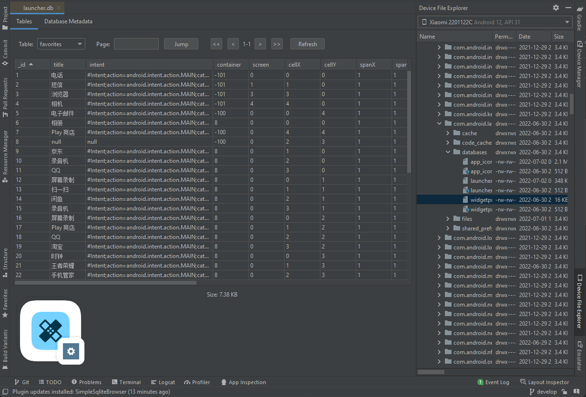
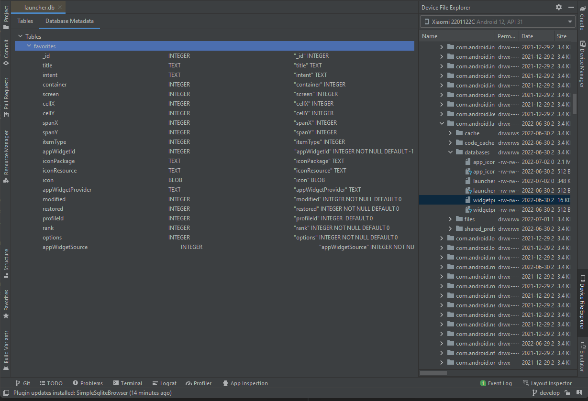

# SimpleSqliteBrowser


[](https://plugins.jetbrains.com/plugin/19797-simplesqlitebrowser)
[](https://plugins.jetbrains.com/plugin/19797-simplesqlitebrowser)

<!-- Plugin description -->
A simple plugin that helps you to view your sqlite databases in `Intellij Platform`. It's also good to directly double-click
the database file to open it in your `Android Studio`-`Device File Explorer` without any extra actions.
<!-- Plugin description end -->

---

## Installation

- Using IDE built-in plugin system:
  
  <kbd>Settings/Preferences</kbd> > <kbd>Plugins</kbd> > <kbd>Marketplace</kbd> > <kbd>Search for "SimpleSqliteBrowser"</kbd> >
  <kbd>Install Plugin</kbd>
  
- Manually:

  Download the [latest release](https://github.com/gitofleonardo/SimpleSqliteBrowser/releases/latest) and install it manually using
  <kbd>Settings/Preferences</kbd> > <kbd>Plugins</kbd> > <kbd>⚙️</kbd> > <kbd>Install plugin from disk...</kbd>


---

## Examples

|  |  |
|--|--|

---

## Credits

+ [tablefilter-swing](https://github.com/coderazzi/tablefilter-swing) of [coderazzi](https://github.com/coderazzi), for filtering table column results.

## License

```
Licensed under the Apache License, Version 2.0 (the "License");
you may not use this file except in compliance with the License.
You may obtain a copy of the License at

   http://www.apache.org/licenses/LICENSE-2.0

Unless required by applicable law or agreed to in writing, software
distributed under the License is distributed on an "AS IS" BASIS,
WITHOUT WARRANTIES OR CONDITIONS OF ANY KIND, either express or implied.
See the License for the specific language governing permissions and
limitations under the License.
```
